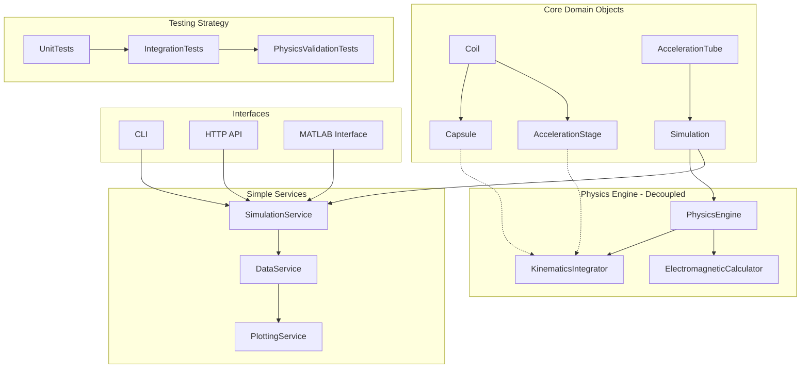

# Electromagnetic Gun Simulation - Final Architecture Design

## Executive Summary

This document presents the final architecture design for the electromagnetic gun simulation project, incorporating SOLID principles and Test-Driven Development (TDD) best practices. The design prioritizes simplicity, robustness, scalability, and maintainability without over-engineering.

## Task Requirements Recap

### Primary Objectives
- **System**: 1D tubular capsule acceleration system with 6 discrete acceleration stages
- **Specifications**: 1 kg capsule, 83mm diameter, 0.5m total tube length, 90mm outer diameter  
- **Deliverables**: Python/OOP simulation + MATLAB integration with UI
- **Requirements**: Clean API, plotting, containerization, documentation, testability

### Technical Stack
- **Core**: Python with OOP principles
- **Testing**: pytest with TDD methodology
- **Integration**: MATLAB interface
- **Deployment**: Docker containerization
- **API**: CLI and HTTP interfaces

## High-Level Architecture Design



## Design Principles Applied

### 1. SOLID Principles Implementation

#### **Single Responsibility Principle (SRP)**
- **Coil**: Manages electromagnetic properties only
- **Capsule**: Handles motion and position only
- **PhysicsEngine**: Pure physics calculations only
- **SimulationService**: Orchestration only

#### **Open/Closed Principle (OCP)**
- **Base Coil Class**: Closed for modification, open for extension
- **New Coil Types**: Can be added without changing existing code
- **Physics Models**: New algorithms can be plugged in easily

#### **Liskov Substitution Principle (LSP)**
- **Coil Hierarchy**: All subclasses (Capsule, AccelerationStage) can substitute base Coil
- **Interface Contracts**: All implementations honor the same contracts

#### **Interface Segregation Principle (ISP)**
- **IPhysicsEngine**: Only physics calculation methods
- **IDataService**: Only data collection methods
- **IPlottingService**: Only visualization methods

#### **Dependency Inversion Principle (DIP)**
- **High-level modules**: Depend on abstractions (interfaces)
- **Low-level modules**: Implement interfaces
- **Configuration**: Injected dependencies

### 2. Test-Driven Development Strategy

#### **Red-Green-Refactor Cycle**
1. **Red**: Write failing test first
2. **Green**: Write minimal code to pass
3. **Refactor**: Improve code while keeping tests green

#### **Test Categories**
- **Unit Tests**: Individual class behavior
- **Integration Tests**: Component interactions
- **Physics Validation**: Compare with known solutions
- **Performance Tests**: Speed and memory requirements

## Core Architecture Components

### 1. Domain Objects (Simple OOP)

```python
# Core data structure
@dataclass
class CoilProperties:
    """Simple data class for coil properties"""
    turns: int
    diameter: float  # meters
    length: float    # meters
    resistance: float # ohms
    position: float = 0.0

# Base class following SRP
class Coil:
    """Base coil class - focused on electromagnetic properties only"""
    def __init__(self, properties: CoilProperties):
        self.properties = properties
        self.current = 0.0
        self._inductance = None  # Lazy calculation
    
    @property
    def inductance(self) -> float:
        """Calculate inductance only when needed"""
        if self._inductance is None:
            self._inductance = self._calculate_inductance()
        return self._inductance

# Extension following OCP
class Capsule(Coil):
    """Capsule - extends Coil without modifying it"""
    def __init__(self, mass: float, diameter: float, length: float):
        # Single-turn conductive loop
        props = CoilProperties(turns=1, diameter=diameter, length=length, 
                             resistance=self._calculate_resistance(diameter, length))
        super().__init__(props)
        self.mass = mass
        self.position = 0.0
        self.velocity = 0.0

class AccelerationStage(Coil):
    """Acceleration stage - extends Coil for electromagnetic coils"""
    def __init__(self, stage_id: int, position: float, turns: int, 
                 diameter: float, length: float, capacitance: float, voltage: float):
        resistance = self._calculate_copper_resistance(turns, diameter, length)
        props = CoilProperties(turns, diameter, length, resistance, position)
        super().__init__(props)
        
        self.stage_id = stage_id
        self.capacitance = capacitance
        self.voltage = voltage
        self.activation_time = None
        self.is_active = False
```

### 2. Decoupled Physics Engine (DIP)

```python
class PhysicsEngine:
    """Centralized, testable physics calculations"""
    
    def __init__(self):
        self.mu_0 = 4 * np.pi * 1e-7  # Permeability of free space
    
    def calculate_mutual_inductance(self, coil1: Coil, coil2: Coil, distance: float) -> float:
        """Calculate mutual inductance between two coils"""
        # Simple analytical approximation - easily testable
        r1 = coil1.properties.diameter / 2
        r2 = coil2.properties.diameter / 2
        
        if distance < coil2.properties.length:
            # Overlapping case
            overlap = max(0, 1 - distance / coil2.properties.length)
            return self.mu_0 * np.sqrt(r1 * r2) * coil2.properties.turns * overlap
        else:
            # Separated case - far field approximation
            return self.mu_0 * np.pi * r1**2 * r2**2 * coil2.properties.turns / (distance**3)
    
    def calculate_force(self, coil1: Coil, coil2: Coil, distance: float, 
                       current1: float, current2: float) -> float:
        """Calculate electromagnetic force between coils"""
        # Numerical gradient of mutual inductance
        dx = 0.001  # 1mm
        
        m_plus = self.calculate_mutual_inductance(coil1, coil2, distance + dx/2)
        m_minus = self.calculate_mutual_inductance(coil1, coil2, distance - dx/2)
        
        dm_dx = (m_plus - m_minus) / dx
        
        # Force = I1 * I2 * dM/dx
        return current1 * current2 * dm_dx
    
    def update_kinematics(self, capsule: Capsule, force: float, dt: float):
        """Simple kinematics update using Verlet integration"""
        acceleration = force / capsule.mass
        
        # Verlet integration (more stable than Euler)
        new_position = capsule.position + capsule.velocity * dt + 0.5 * acceleration * dt**2
        new_velocity = capsule.velocity + acceleration * dt
        
        capsule.position = new_position
        capsule.velocity = new_velocity

class KinematicsIntegrator:
    """Separate kinematics calculations for modularity"""
    
    def __init__(self, integration_method="verlet"):
        self.integration_method = integration_method
        self.history = []
    
    def integrate_step(self, capsule: Capsule, force: float, dt: float):
        """Perform single integration step"""
        if self.integration_method == "verlet":
            self._verlet_step(capsule, force, dt)
        elif self.integration_method == "runge_kutta":
            self._rk4_step(capsule, force, dt)
        
        # Record state
        self.history.append({
            'time': len(self.history) * dt,
            'position': capsule.position,
            'velocity': capsule.velocity,
            'acceleration': force / capsule.mass,
            'force': force
        })
```

### 3. Simple Simulation Service (SRP)

```python
class SimulationService:
    """Main simulation orchestrator - simple and focused"""
    
    def __init__(self, capsule: Capsule, stages: List[AccelerationStage], 
                 tube_length: float, dt: float = 1e-5):
        self.capsule = capsule
        self.stages = stages
        self.tube_length = tube_length
        self.dt = dt
        self.physics = PhysicsEngine()
        self.data = DataService()
        self.time = 0.0
    
    def run(self, max_time: float = 0.01) -> 'SimulationResult':
        """Run the simulation"""
        while self.time < max_time and self.capsule.position < self.tube_length:
            self._step()
            self.time += self.dt
        
        return self.data.get_results()
    
    def _step(self):
        """Single simulation step"""
        # Check for stage activations
        self._check_stage_activations()
        
        # Calculate induced current in capsule
        self._update_capsule_current()
        
        # Calculate total force on capsule
        total_force = self._calculate_total_force()
        
        # Update kinematics
        self.physics.update_kinematics(self.capsule, total_force, self.dt)
        
        # Record data
        self.data.record(self.time, self.capsule, self.stages, total_force)
    
    def _check_stage_activations(self):
        """Activate stages when capsule approaches"""
        for stage in self.stages:
            if not stage.is_active:
                distance_to_stage = abs(self.capsule.position - stage.properties.position)
                # Activate when capsule is 1 coil length away
                if distance_to_stage <= stage.properties.length:
                    stage.activate(self.time)
    
    def _calculate_total_force(self) -> float:
        """Calculate total electromagnetic force"""
        total_force = 0.0
        
        for stage in self.stages:
            if stage.is_active:
                stage_current = stage.get_current(self.time)
                distance = abs(self.capsule.position - stage.properties.position)
                
                force = self.physics.calculate_force(
                    self.capsule, stage, distance, 
                    self.capsule.current, stage_current
                )
                total_force += force
        
        return total_force
```

## Test-Driven Development Implementation

### 1. Unit Tests (TDD Red-Green-Refactor)

```python
# tests/test_physics_engine.py
class TestPhysicsEngine:
    """Comprehensive physics engine tests"""
    
    def setUp(self):
        self.physics = PhysicsEngine()
        self.capsule = Capsule(mass=1.0, diameter=0.083, length=0.02)
        self.stage = AccelerationStage(0, 0.083, 100, 0.09, 0.05, 1000e-6, 400)
    
    def test_mutual_inductance_units_and_magnitude(self):
        """Test 1: Mutual inductance has correct units (Henries)"""
        mutual_inductance = self.physics.calculate_mutual_inductance(
            self.capsule, self.stage, distance=0.01)
        
        # Should be positive and reasonable magnitude
        assert mutual_inductance > 0
        assert mutual_inductance < 1e-3  # Less than 1mH
    
    def test_force_symmetry(self):
        """Test 2: Force calculation is symmetric"""
        distance = 0.01
        current1, current2 = 100.0, 50.0
        
        force1 = self.physics.calculate_force(
            self.capsule, self.stage, distance, current1, current2)
        force2 = self.physics.calculate_force(
            self.stage, self.capsule, distance, current2, current1)
        
        assert abs(force1 - force2) < 1e-10
    
    def test_inductance_decreases_with_distance(self):
        """Test 3: Physics behavior validation"""
        distance_near = 0.01
        distance_far = 0.1
        
        inductance_near = self.physics.calculate_mutual_inductance(
            self.capsule, self.stage, distance_near)
        inductance_far = self.physics.calculate_mutual_inductance(
            self.capsule, self.stage, distance_far)
        
        assert inductance_near > inductance_far

# tests/test_simulation_integration.py
class TestSimulationIntegration:
    """Integration tests for complete simulation"""
    
    def test_energy_conservation(self):
        """Test 4: Energy conservation during simulation"""
        capsule = Capsule(mass=1.0, diameter=0.083, length=0.02)
        stages = [AccelerationStage(i, i*0.083, 100, 0.09, 0.05, 1000e-6, 400) 
                 for i in range(6)]
        simulation = SimulationService(capsule, stages, tube_length=0.5)
        
        initial_energy = sum(0.5 * stage.capacitance * stage.voltage**2 
                           for stage in stages)
        
        result = simulation.run(max_time=0.005)
        
        final_kinetic = 0.5 * capsule.mass * capsule.velocity**2
        
        # Energy should be partially converted to kinetic energy
        assert final_kinetic > 0
        assert final_kinetic < initial_energy  # Some losses expected
    
    def test_capsule_motion_forward(self):
        """Test 5: Capsule moves in correct direction"""
        capsule = Capsule(mass=1.0, diameter=0.083, length=0.02)
        stages = [AccelerationStage(0, 0.083, 100, 0.09, 0.05, 1000e-6, 400)]
        simulation = SimulationService(capsule, stages, tube_length=0.5)
        
        initial_position = capsule.position
        
        result = simulation.run(max_time=0.005)
        
        assert capsule.position > initial_position
        assert capsule.velocity > 0
```

### 2. Performance and Validation Tests

```python
# tests/test_performance.py
class TestPerformance:
    """Performance requirements validation"""
    
    def test_simulation_speed_requirement(self):
        """Test 6: Simulation completes within time limit"""
        import time
        
        start_time = time.time()
        
        capsule = Capsule(mass=1.0, diameter=0.083, length=0.02)
        stages = [AccelerationStage(i, i*0.083, 100, 0.09, 0.05, 1000e-6, 400) 
                 for i in range(6)]
        simulation = SimulationService(capsule, stages, tube_length=0.5)
        
        result = simulation.run(max_time=0.005)
        
        elapsed = time.time() - start_time
        
        # Should complete in less than 5 seconds
        assert elapsed < 5.0

# tests/test_physics_validation.py
class TestPhysicsValidation:
    """Validate against known physics solutions"""
    
    def test_solenoid_inductance_formula(self):
        """Test 7: Validate inductance against textbook formula"""
        coil = Coil(CoilProperties(turns=100, diameter=0.05, length=0.1, resistance=1.0))
        
        # Compare with Wheeler's formula
        expected_inductance = 4 * np.pi * 1e-7 * (100**2) * np.pi * (0.025**2) / 0.1
        
        assert abs(coil.inductance - expected_inductance) / expected_inductance < 0.01
```

## Project Structure

```
electromagnetic_gun_simulation/
├── src/
│   ├── core/
│   │   ├── __init__.py
│   │   ├── coil.py                 # Base Coil class
│   │   ├── capsule.py              # Capsule implementation
│   │   ├── acceleration_stage.py   # AccelerationStage implementation
│   │   └── acceleration_tube.py    # Container for stages
│   ├── physics/
│   │   ├── __init__.py
│   │   ├── physics_engine.py       # Core physics calculations
│   │   └── kinematics_integrator.py # Motion integration
│   ├── services/
│   │   ├── __init__.py
│   │   ├── simulation_service.py   # Main orchestrator
│   │   ├── data_service.py         # Data collection
│   │   └── plotting_service.py     # Visualization
│   ├── interfaces/
│   │   ├── __init__.py
│   │   ├── cli.py                  # Command line interface
│   │   ├── http_api.py            # REST API with FastAPI
│   │   └── matlab_interface.py     # MATLAB integration
│   ├── config/
│   │   ├── __init__.py
│   │   └── simulation_config.py    # Configuration management
│   └── utils/
│       ├── __init__.py
│       ├── validators.py           # Input validation
│       └── converters.py          # Unit conversions
├── tests/
│   ├── __init__.py
│   ├── unit/
│   │   ├── test_coil.py
│   │   ├── test_capsule.py
│   │   ├── test_physics_engine.py
│   │   └── test_simulation_service.py
│   ├── integration/
│   │   ├── test_simulation_integration.py
│   │   └── test_api_integration.py
│   ├── performance/
│   │   └── test_performance.py
│   └── validation/
│       └── test_physics_validation.py
├── matlab/
│   ├── simulation_wrapper.m
│   ├── ui_interface.m
│   └── plotting_functions.m
├── docker/
│   ├── Dockerfile
│   ├── docker-compose.yml
│   └── requirements.txt
├── docs/
│   ├── api_documentation.md
│   ├── physics_assumptions.md
│   └── user_guide.md
├── examples/
│   ├── basic_simulation.py
│   ├── parameter_sweep.py
│   └── sample_configs/
└── scripts/
    ├── run_tests.sh
    ├── build_docker.sh
    └── generate_docs.sh
```

## Configuration Management

```python
# src/config/simulation_config.py
@dataclass
class SimulationConfig:
    """Configuration with sensible defaults and validation"""
    
    # Capsule properties
    capsule_mass: float = 1.0  # kg
    capsule_diameter: float = 0.083  # m
    capsule_length: float = 0.02  # m
    
    # Tube properties
    tube_length: float = 0.5  # m
    tube_diameter: float = 0.09  # m
    num_stages: int = 6
    
    # Electrical properties
    stage_voltage: float = 400.0  # V
    stage_capacitance: float = 1000e-6  # F
    stage_turns: int = 100
    
    # Simulation properties
    time_step: float = 1e-5  # s
    max_time: float = 0.01  # s
    integration_method: str = "verlet"
    
    def __post_init__(self):
        """Validate configuration parameters"""
        if self.capsule_mass <= 0:
            raise ValueError("Capsule mass must be positive")
        if self.time_step <= 0:
            raise ValueError("Time step must be positive")
        if self.num_stages <= 0:
            raise ValueError("Number of stages must be positive")
    
    @classmethod
    def from_file(cls, filename: str) -> 'SimulationConfig':
        """Load configuration from JSON file"""
        import json
        with open(filename, 'r') as f:
            data = json.load(f)
        return cls(**data)
    
    def to_file(self, filename: str):
        """Save configuration to JSON file"""
        import json
        from dataclasses import asdict
        with open(filename, 'w') as f:
            json.dump(asdict(self), f, indent=2)
```

## Interface Implementations

### CLI Interface
```python
# src/interfaces/cli.py
import click
from src.config.simulation_config import SimulationConfig
from src.services.simulation_service import SimulationService

@click.command()
@click.option('--config', default='config/default.json', help='Configuration file path')
@click.option('--output', default='results/', help='Output directory')
@click.option('--plot', is_flag=True, help='Generate plots')
def simulate(config, output, plot):
    """Run electromagnetic gun simulation"""
    config_obj = SimulationConfig.from_file(config)
    
    # Create simulation
    simulation = SimulationService.from_config(config_obj)
    
    # Run simulation
    result = simulation.run()
    
    # Save results
    result.save_to_directory(output)
    
    # Generate plots if requested
    if plot:
        from src.services.plotting_service import PlottingService
        plotter = PlottingService()
        plotter.generate_all_plots(result, output)
    
    click.echo(f"Simulation completed. Results saved to {output}")
```

### HTTP API Interface
```python
# src/interfaces/http_api.py
from fastapi import FastAPI, HTTPException
from pydantic import BaseModel
from src.config.simulation_config import SimulationConfig
from src.services.simulation_service import SimulationService

app = FastAPI(title="Electromagnetic Gun Simulation API")

class SimulationRequest(BaseModel):
    config: dict
    max_time: float = 0.01

@app.post("/api/simulate")
async def run_simulation(request: SimulationRequest):
    """Run simulation with provided configuration"""
    try:
        config = SimulationConfig(**request.config)
        simulation = SimulationService.from_config(config)
        result = simulation.run(max_time=request.max_time)
        
        return {
            "status": "success",
            "final_velocity": result.final_velocity,
            "total_time": result.total_time,
            "data": result.to_dict()
        }
    except Exception as e:
        raise HTTPException(status_code=400, detail=str(e))

@app.get("/api/health")
async def health_check():
    """Health check endpoint"""
    return {"status": "healthy"}
```

### MATLAB Interface
```python
# src/interfaces/matlab_interface.py
class MATLABInterface:
    """Interface for MATLAB integration"""
    
    @staticmethod
    def simulate_from_matlab(mass, diameter, length, stages_config):
        """
        Entry point for MATLAB calls
        
        Args:
            mass: Capsule mass (kg)
            diameter: Capsule diameter (m)
            length: Capsule length (m)
            stages_config: List of stage configurations
        
        Returns:
            Dictionary with simulation results
        """
        from src.core.capsule import Capsule
        from src.core.acceleration_stage import AccelerationStage
        from src.services.simulation_service import SimulationService
        
        # Create capsule
        capsule = Capsule(mass, diameter, length)
        
        # Create stages
        stages = []
        for i, stage_config in enumerate(stages_config):
            stage = AccelerationStage(
                stage_id=i,
                position=stage_config['position'],
                turns=stage_config['turns'],
                diameter=stage_config['diameter'],
                length=stage_config['length'],
                capacitance=stage_config['capacitance'],
                voltage=stage_config['voltage']
            )
            stages.append(stage)
        
        # Run simulation
        simulation = SimulationService(capsule, stages, tube_length=0.5)
        result = simulation.run()
        
        return result.to_dict()
```

## Key Benefits of This Architecture

1. **Simplicity**: Clean, understandable design without over-engineering
2. **SOLID Compliance**: Follows all SOLID principles naturally
3. **Testability**: Comprehensive TDD approach with multiple test categories
4. **Extensibility**: Easy to add new features without breaking existing code
5. **Performance**: Efficient physics calculations and integration methods
6. **Maintainability**: Clear separation of concerns and well-documented interfaces
7. **Scalability**: Can handle different simulation sizes and configurations
8. **Integration Ready**: Multiple interfaces (CLI, API, MATLAB) for different use cases

## Implementation Plan

### Phase 1: Core Implementation (TDD)
1. Write tests for basic Coil class
2. Implement Coil class to pass tests
3. Write tests for Capsule class
4. Implement Capsule class
5. Write tests for AccelerationStage class
6. Implement AccelerationStage class

### Phase 2: Physics Engine (TDD)
1. Write tests for PhysicsEngine
2. Implement basic electromagnetic calculations
3. Write tests for KinematicsIntegrator
4. Implement motion integration
5. Validate against known physics solutions

### Phase 3: Simulation Service (TDD)
1. Write tests for SimulationService
2. Implement simulation orchestration
3. Write integration tests
4. Implement data collection and analysis

### Phase 4: Interfaces and Integration
1. Implement CLI interface
2. Implement HTTP API
3. Implement MATLAB interface
4. Create Docker containerization
5. Write comprehensive documentation

This architecture provides a solid foundation for building a robust, maintainable, and extensible electromagnetic gun simulation system while following industry best practices.